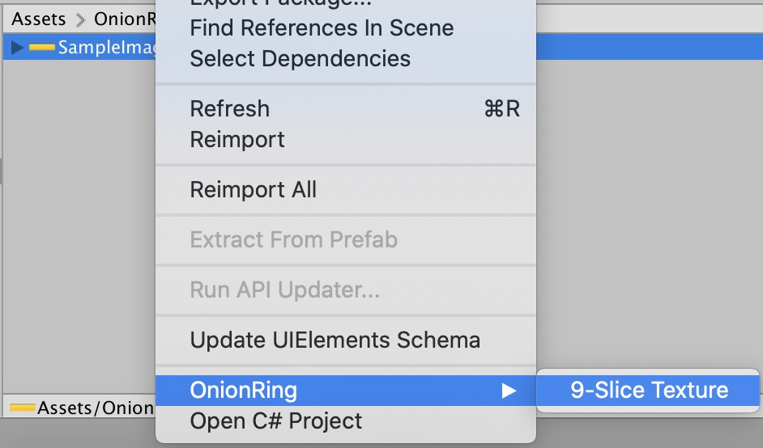

# OnionRing

## Information
Auto 9-slicing sprite by spriteborders

## Instalation

### Using Git

Find the manifest.json file in the Packages folder of your project and add a line to `dependencies` field.

* `"dev.fd.onionring": "https://github.com/ShutovPS/OnionRing-Unity.git"`

To update the package, change suffix `#{version}` to the target version.

* `"dev.fd.onionring": "https://github.com/ShutovPS/OnionRing-Unity.git#1.0.3",`

Or, use [UpmGitExtension](https://github.com/mob-sakai/UpmGitExtension) to install and update the package.

## Instruction

Configure source image

Invoke action

Get result image

## Release Notes

CHANGELOG (see [CHANGELOG](CHANGELOG.MD))

## License

MIT License (see [LICENSE](LICENSE))

## See Also

* Original GitHub Page https://github.com/kyubuns/Auto9Slicer
